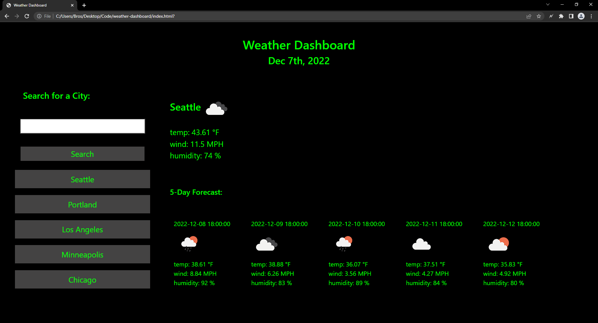

# weather-dashboard
## Description
weather-dashboard is a website that gives the weather forecast for the next 5 days, and the today's weather. The user's search is also saved using local storage. It's also very simply made to be easy on the eye in a dark room. Hence the terminal looking style.
## Table of Contents
- [Contributions](#contributions) 
- [Website_Screenshot](#website_screenshot)
- [Link](#link)
- [Questions](#questions) 
## Contributions

David Kovalchuk

## Website_Screenshot

## Link
https://itsdavidk.github.io/weather-dashboard/
## Questions
You can reach me on GitHub at [itsDavidK](https://github.com/itsDavidK).
